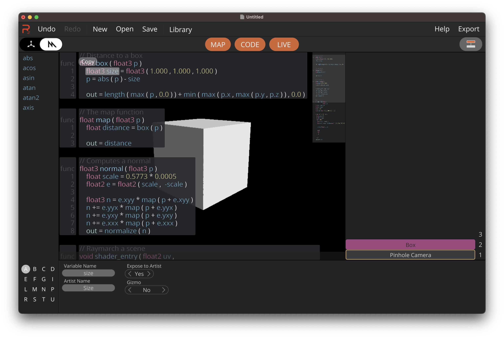
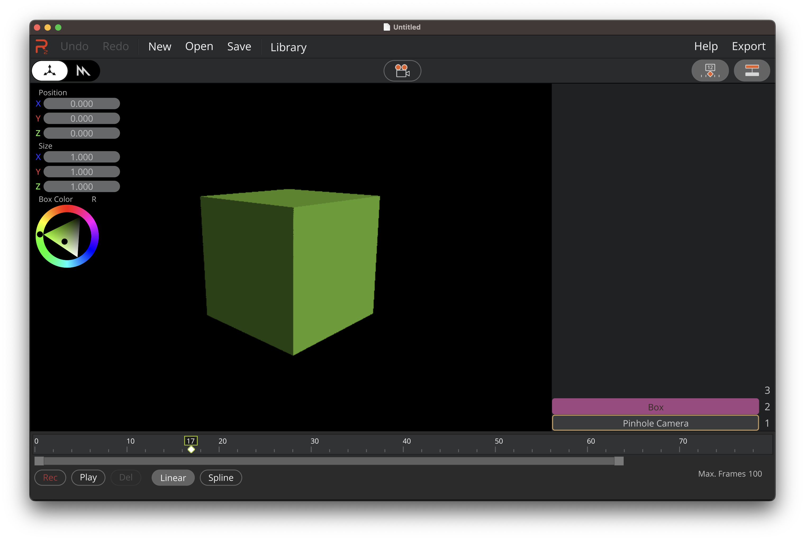
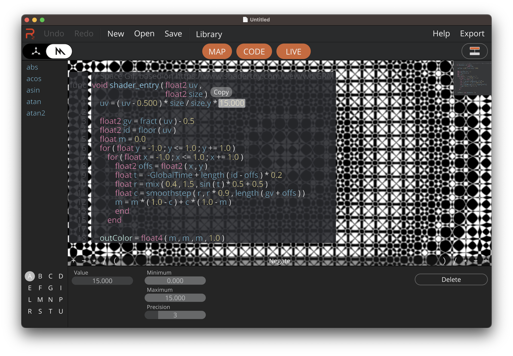

+++
title = "Render-Z"
weight = 2
+++

Render-Z - pronounced *Render That* - is a visual *Metal* shader editor for macOS and iPadOS. Render-Z is open source and licensed under the MIT.

Render-Z is currently available via TestFlight for macOS and iPadOS, use the link [here](https://testflight.apple.com/join/HjxMytcc).

### Developers Create and Edit Shaders Visually

* Simply drag and drop functions and variables
* Integrated workflow for being able to create complex expressions
* Share functions and shaders via iCloud publically or privately
* Expose variables to artists

### Artists use Gizmos to edit Variables

* Variables exposed by developers can be edited by Gizmos in the Artist Editor
* A timeline for variables makes animation easy
* Export images and videos

### Use Render-Z to

* Learn and explore the Metal shader language
* Create demos and presentations utilizing Metal shaders
* Raytrace images of procedural content with the integrated BSDF Pathracer (WiP)

